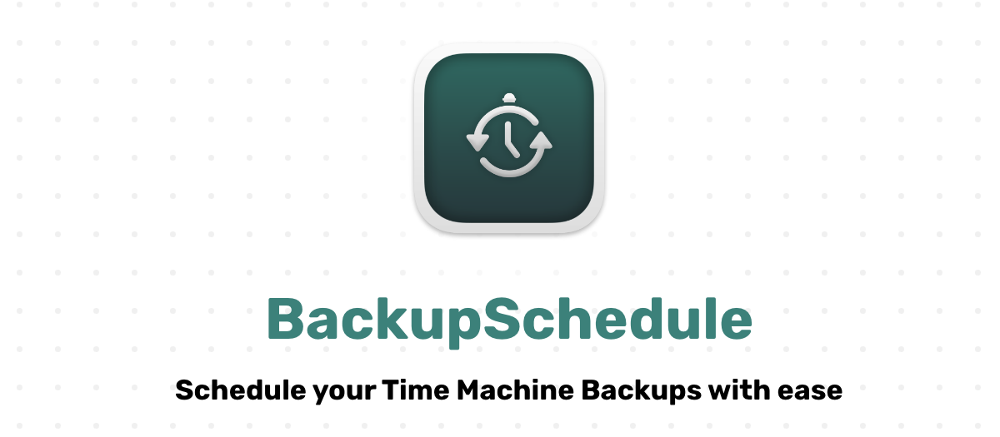
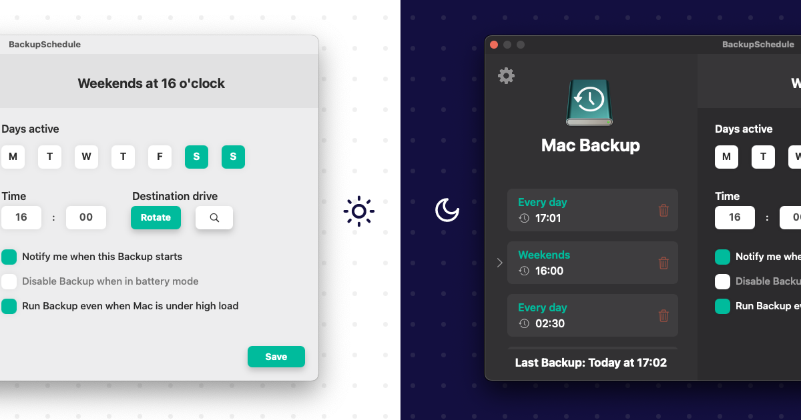

BackupSchedule is a macOS application that wraps around the preinstalled tmutil binary, allowing you to schedule your backups granularly.
It fully replaces the Time Machine menu bar icon.

## 📙 Features
**Schedule creation**
- Create unlimited schedules by selecting the days and time the backup should run
- Select disk rotation or a specific disk the backup should target

**Utility functions**
- Auto backup trigger (if computer has not been backed up for X days)
- Auto remove snapshots (after X days)

**Menu bar**
- Menu bar replacement for default Time Machine menu bar icon 

  

<i>Supports light and dark mode</i>

 

## 🖥️ System requirements
macOS 10.14 or higher
  
## ⬇️ Installation
- Download the latest compiled release from the [Releases](https://github.com/Tohr01/BackupSchedule/releases) tab
 or
- Compile from source

## 🍩 Acknowledgements
- [LaunchAtLogin-Legacy](https://github.com/sindresorhus/LaunchAtLogin-Legacy) by sindresorhus

## 📑 License
This project is licensed under the MIT License. See [License](LICENSE) for more information.
